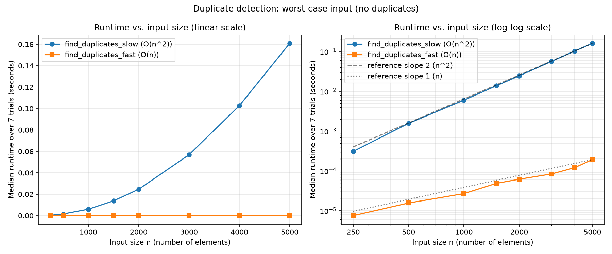

# CMPSC 202 - Midterm Programming Assignment

Name: Issei Hasegawa

**Instructions**: Complete the exercise below. Open book, open notes, any tools allowed (except submitting another student's work). Due tonight (10/6) at 11:59pm.

**Submission**: Fork this repository and invite your professor (username: bcmullins) to the repository. To submit, push your code to your forked repository. Make sure to include your name in the README file.

You have been provided with a starter Python file (`midterm_starter.py`). This file contains two fully implemented algorithms that solve the exact same problem: finding if an array contains duplicate values.

The file also contains a `flawed_benchmark()` function. The developer who wrote this benchmark made several severe methodological errors, making the printed timing results completely unreliable for comparing the asymptotic growth of these two algorithms.

**Your tasks**: 

1. Rewrite the `flawed_benchmark()` function to provide a robust empirical comparison of the two algorithms. List the methodological errors in the original benchmark and explain how you fixed them. Your benchmark should demonstrate the scaling behavior of the two algorithms across multiple input sizes.

   1. The original benchmark only tested one input size (n = 1000). With only one data point, it is impossible to tell how the running time grows as the input gets larger, which is the whole point of comparing an O(n^2) algorithm with an O(n) one. I changed the benchmark to use sizes that double each time, from 250 up to 128,000, so the growth can be seen in the plot. The slow algorithm is only run up to n = 8000, because its time grows with n^2 and larger sizes would take too long. The fast algorithm is run on all sizes, so its linear growth can be checked over a much wider range (more than 500 times from the smallest to the largest n).

   2. The timer was started before the input list was created, so the time it took to build the list was included in the measured time. Creating the list takes O(n) time on its own, so this adds extra time that has nothing to do with the algorithm, and it hides the difference between the two algorithms, especially for the fast one. I now generate the input first and only start the timer right before calling the algorithm and stop it right after.

   3. The two algorithms were given different random lists (data1 and data2). Since the inputs were not the same, the comparison was not fair. For example, one list might have a duplicate near the beginning and the other near the end. In my version, one list is generated for each trial and both algorithms get a copy of that same list.

   4. The way the input was generated, random.randint(i, 10000), almost always produces duplicates. Both algorithms return True as soon as they find the first duplicate, so most of the time they stop early and never do their full amount of work. This means the measured time depends on where the first duplicate happens to be rather than on n. Also, when n is larger than 10001, the lower bound i becomes bigger than 10000 and randint raises a ValueError, so the benchmark cannot even run for larger sizes. To fix this, I used random.sample(range(10 * n), n), which gives n distinct numbers. Since there are no duplicates, both algorithms have to check the entire list, which is the worst case, so the times reflect O(n^2) and O(n).

   5. time.time() measures wall-clock time and its resolution can be too coarse for very short runs. The fast algorithm finishes in microseconds, so the measurement can be inaccurate. time.time() can also be affected if the system clock is adjusted. I replaced it with time.perf_counter(), which has a higher resolution and is meant for measuring short time intervals.

   6. Each algorithm was only run once. A single run can be affected by other processes on the computer, caching, or garbage collection, so one measurement is not reliable. I now run 7 trials for each input size and use the median, which is less affected by outliers than the average. I also turned off garbage collection during the timing, did a warm-up run before the real measurements, and alternated the order of the two algorithms in each trial so that neither one always runs first.

   7. No random seed was set, so the input data and the results were different every time the program ran. I added random.seed(202) at the start so the results can be reproduced.

   8. The original code only printed two numbers, so there was no way to see a trend. My version stores the median time for each size and plots both algorithms in results.png. The plot has a normal (linear) scale graph and a log-log graph. On the log-log graph, I added reference lines with slope 2 and slope 1. The program also fits a straight line to the log of n and the log of the time using least squares, and prints the slope for each algorithm. The slope is also shown in the legend. This way the growth rate is measured from the data instead of only judged by looking at the graph.

2. Run the empirical comparion and plot the results using a plotting library of your choice (e.g., `matplotlib`, `seaborn`, etc.). Include the plot in your submission called `results.png`. Be sure to label your axes and include a legend.

   

   The results match the expected growth rates. The numbers below are from the run shown in results.png. The exact times change a little every time the program is run, but the overall pattern stays the same. From n = 500 on, every time n doubles, the slow algorithm takes about 4 times longer (for example, 0.0062 s at n = 1000, 0.0255 s at n = 2000, 0.103 s at n = 4000, and 0.416 s at n = 8000). The fast algorithm only takes about 2 times longer each time n doubles (0.000027 s at n = 1000 and 0.000058 s at n = 2000), and this keeps going all the way up to n = 128,000, where it takes 0.0048 s. Some of the steps for the fast algorithm are a bit off from exactly 2 times (between about 1.7 and 2.4 times). When I ran the benchmark again, the same steps were off in the same way, so this does not seem to be just random noise. I did not figure out the exact cause, but the overall trend is still clearly linear. The jump from 250 to 500 is about 5 times for the slow algorithm. This also happened every time I reran it, so it is not just noise either, and I am not sure what causes it. All the steps after that are close to 4 times and the fitted slope is about 2, so it does not change the conclusion.

   The log-log graph makes this easier to see. On a log-log plot, a function like n^k shows up as a straight line with slope k. The program fits a line to the measured times with least squares, and the slope was 2.09 for the slow algorithm and 1.05 for the fast algorithm. These are very close to the expected values of 2 for O(n^2) and 1 for O(n), and both lines follow the reference lines in the plot. The linear graph only shows sizes up to 8000, where both algorithms were measured. In that graph the fast algorithm looks almost flat because it is so much faster. At n = 8000, the slow algorithm took 0.416 s and the fast algorithm took 0.00028 s, which is about 1,500 times faster, and this gap keeps growing as n gets larger.
